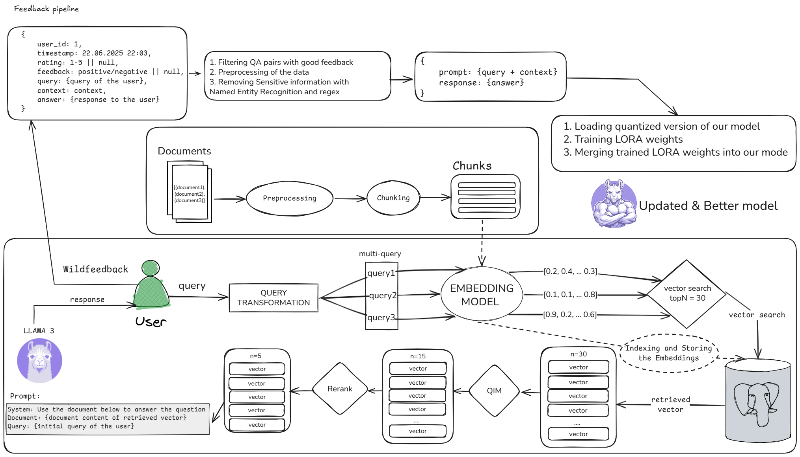

# AURA: Adaptive User-driven Retrieval Architecture

An adaptive AI system with a feedback-powered RAG pipeline. AURA uses WildFeedback to capture user preferences automatically and fine-tunes lightweight LoRA adapters on a LLaMA base model, enabling continuous, low-cost, scalable learning. The quantized model (GGUF) serves fast, cost-efficient responses via llama.cpp.



---

## Why AURA

- **Problem**: Typical RAG systems do not learn from user interactions and fail to adapt in real-world use.
- **Goal**: Build an autonomous system that continuously improves by extracting feedback directly from conversations and iteratively fine-tuning.

---

## Quickstart (Local)

### Prerequisites

- Python 3.10+
- Node 18+
- LM Studio or a compatible llama.cpp HTTP server for chat completions
- `RAG/documents.json` (JSON list of docs with fields: `id`, `title`, `content`)

### 1) Install dependencies

```bash
python -m venv .venv && source .venv/bin/activate
pip install -r requirements.txt
cd frontend && npm install
```

### 2) Prepare RAG documents

Ensure `RAG/documents.json` exists. Minimal example (array of objects):

```json
[
  { "id": "doc-1", "title": "Intro", "content": "AURA overview..." },
  { "id": "doc-2", "title": "Setup", "content": "How to run..." }
]
```

On first run, a FAISS index (`rag.index`) and metadata (`rag_meta.json`) are built automatically.

### 3) Start the backend

```bash
cd backend
uvicorn main:app --host 0.0.0.0 --port 8000 --reload
```

Notes:
- Backend calls the LLM at `LMSTUDIO_ENDPOINT` (defaults to `http://localhost:1234/v1/chat/completions`) with `MODEL_NAME` (defaults to `my-model`). You can change these constants in `backend/main.py`.
- CORS is open for development; restrict before production.

### 4) Start the frontend

```bash
cd frontend
npm run dev
```

The app fetches `POST http://localhost:8000/chat` directly (see `frontend/src/App.jsx`).

### 5) (Optional) Desktop UI

```bash
python ui.py
```

---

## Docker (Dev)

```bash
docker compose up --build
```

Services:
- `frontend`: Vite dev server on `http://localhost:3000`
- `backend`: FastAPI on `http://localhost:8000`

Tip: The current backend image installs a minimal set of packages. For full RAG/feedback in-container, extend the Dockerfile to install the project `requirements.txt`.

---

## API

Base URL: `http://localhost:8000`

- `GET /` → `{ "status": "API is running" }`
- `POST /chat`
  - Request body:
    ```json
    { "message": "What is AURA?" }
    ```
  - Response body (abridged):
    ```json
    {
      "user": "What is AURA?",
      "reply": "...",
      "feedback": "SAT | DSAT | Unknown",
      "retrieved_docs": [ { "id": "...", "title": "...", "content": "..." } ]
    }
    ```

---

## RAG Pipeline

Located in `RAG/`:

- `pipeline.py`: Builds/loads FAISS index from `RAG/documents.json` using `SentenceTransformer` embeddings. On query, retrieves top-k and optionally reranks.
- `reranker.py`: CrossEncoder reranker (`cross-encoder/ms-marco-MiniLM-L-6-v2`).

Key behavior:
- Index is built on-demand and cached to `rag.index` with metadata `rag_meta.json`.
- GPU is used for embeddings if available.

---

## WildFeedback (Satisfaction & Strategy Signals)

Located in `wildfeedback/`:

- `praise.py` (`PraisePipeline`):
  - Loads strategy templates from `wildfeedback/data/strategies.json`.
  - Embeds with `all-MiniLM-L6-v2` and computes similarity features.
  - Uses `praise_classifier.pkl` (LogReg) to output soft probabilities over labels.
- `train_classifier.py`:
  - Trains a logistic regression classifier from `wildfeedback/data/satisfaction_labels.json`.
  - Produces `wildfeedback/praise_classifier.pkl`.

Train the classifier:

```bash
cd wildfeedback
python train_classifier.py
```

---

## Fine-tuning and Model Lifecycle

Config is loaded from `config.py` which reads environment variables:

```env
BASE_MODEL_PATH=NousResearch/Hermes-3-Llama-3.2-3b
LORA_PATH=./outputs/lora
OUTPUT_PATH=./outputs/merged
```

### 1) LoRA fine-tuning

```bash
python train.py
```

Details:
- Base model: `NousResearch/Hermes-3-Llama-3.2-3b`
- 8-bit loading with PEFT LoRA (`q_proj`, `v_proj`), sequence length 512
- Input data: `wildfeedback/data/conversations_raw.json`
- Output adapters written to `LORA_PATH`

### 2) Merge LoRA → base

```bash
python merged.py
```

Writes a merged Hugging Face model to `OUTPUT_PATH`.

### 3) Convert HF → GGUF (llama.cpp) and quantize

Example using llama.cpp:

```bash
# Convert HF weights to GGUF
python ./convert-hf-to-gguf.py --model "$OUTPUT_PATH" --outfile ./outputs/model.gguf

# Quantize to Q8_0 (or desired type)
./quantize ./outputs/model.gguf ./outputs/model.Q8_0.gguf q8_0
```

### 4) Serve with llama.cpp (or LM Studio)

For development, you can use LM Studio and configure the model name to match `MODEL_NAME` in `backend/main.py`.

---

## Cloud Path (AWS, optional)

1. Push `wildfeedback/data/conversations_raw.json` to S3 (or stream logs directly).
2. Launch a SageMaker training job to run `train.py` and write LoRA adapters to S3.
3. Merge adapters with the base model (`merged.py`) and convert to GGUF.
4. Host updated model on SageMaker endpoint or a GPU EC2 instance running llama.cpp.
5. Point `LMSTUDIO_ENDPOINT` in the backend to the new endpoint.

---

## Project Layout

```
backend/            # FastAPI app (endpoints: /, /chat)
frontend/           # React + Vite + Tailwind chat UI
RAG/                # Retrieval (FAISS) + reranker
wildfeedback/       # Feedback pipeline, classifier training, data
train.py            # LoRA fine-tuning script
merged.py           # Merge LoRA adapters into base HF model
ui.py               # Optional desktop chat UI
requirements.txt    # Python dependencies
docker-compose.yaml # Dev compose (frontend + backend)
docs/               # Diagrams, slides
```

---

## System Overview

- **Frontend**: React + TailwindCSS (`frontend/`)
- **Backend**: FastAPI (`backend/`)
- **RAG**: FAISS + SentenceTransformers (`RAG/`)
- **Feedback**: WildFeedback satisfaction inference (`wildfeedback/`)
- **LLM**: LLaMA 3.x (Nous Hermes) with LoRA fine-tuning and GGUF inference
- **Containers**: Docker + Docker Compose
- **Cloud (optional)**: AWS S3 for data, SageMaker for training/hosting

## Technologies

- **Models**: LLaMA 3.x (Nous Hermes variant)
- **Fine-tuning**: LoRA via PEFT
- **Quantization & Inference**: llama.cpp (GGUF)
- **Frameworks**: Hugging Face Transformers, PEFT, PyTorch
- **Cloud Services**: AWS S3, AWS SageMaker

## Learning Loop

1. Store raw conversations in S3 (or locally in `wildfeedback/data/conversations_raw.json`).
2. WildFeedback generates structured training data and satisfaction labels.
3. LoRA fine-tuning on base LLaMA model (Hermes 3).
4. Merge LoRA → base; convert HF weights to GGUF via llama.cpp and quantize (e.g., Q8_0).
5. Deploy updated model (e.g., SageMaker endpoint or local llama.cpp server).

---

## Security & Production Notes

- Restrict `CORS` (`backend/main.py`) before deploying.
- Store raw conversations securely; anonymize if needed.
- Validate and sanitize uploaded/ingested documents.
- Prefer private endpoints and IAM roles when using AWS.

---

## Acknowledgments

- FastAPI, Uvicorn
- SentenceTransformers, FAISS
- Hugging Face Transformers, PEFT, PyTorch
- llama.cpp
